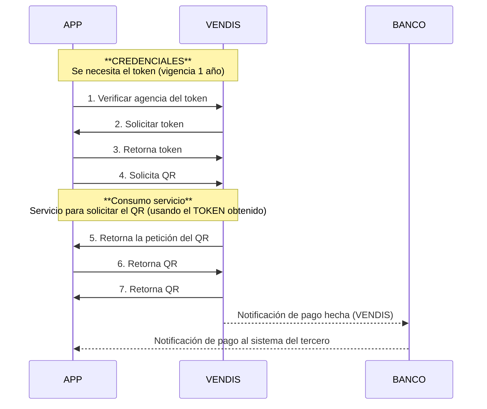
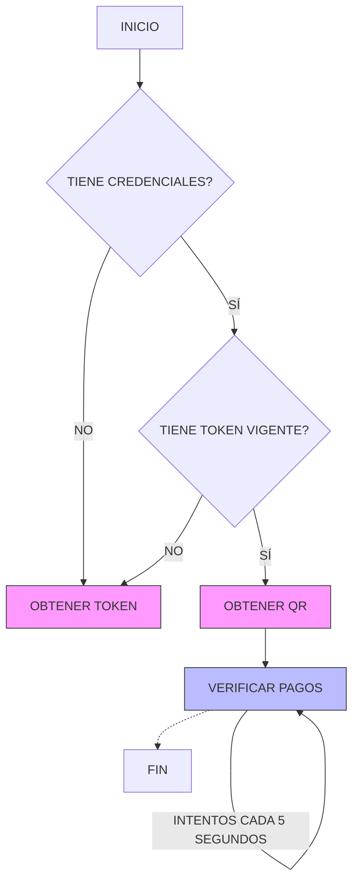

# Vendis - QR Dinámico para Pagos  

**API REST Documentation**  
**Versión 1.3**

## Objetivo
El objetivo de este documento es presentar los servicios necesarios para poder obtener el QR de cobro y la notificación del callback.

## Estructura de Consumo del API

A continuación se muestra la estructura general del consumo del API, tal como aparece en el documento original. Se replican los dos diagramas principales usando sintaxis **Mermaid** (compatible con la mayoría de visores Markdown) para una representación fiel y renderizable.

### 1. Diagrama de Secuencia (izquierda del documento original)

Este diagrama muestra el flujo de **credenciales** y el **consumo del servicio** entre la **APP**, **VENDIS** y el **BANCO**.



**Explicación paso a paso del Diagrama de Secuencia:**

1. **Credenciales**: La APP verifica con VENDIS la agencia asociada al token.
2. La APP solicita el token de autenticación a VENDIS.
3. VENDIS devuelve el token (válido por 1 año).
4. La APP usa ese token para solicitar la generación del QR.
5. **Consumo del servicio**: VENDIS procesa la solicitud y devuelve la petición del QR.
6-7. VENDIS devuelve el QR generado a la APP.
8. Cuando se realiza un pago, VENDIS notifica al banco.
9. El banco notifica al sistema del tercero (la APP o tu servidor) vía callback.

### 2. Diagrama de Flujo (derecha del documento original)

Este diagrama muestra el flujo completo del proceso, desde el inicio hasta el pago (incluyendo verificación periódica).



**Explicación paso a paso del Diagrama de Flujo:**

1. **INICIO**: Comienza el proceso.
2. **¿Tiene credenciales?** → Si no, se obtiene el token.
3. **¿Tiene token vigente?** → Si no, se obtiene/renueva el token (válido 1 año).
4. **Obtener QR**: Se genera el QR dinámico.
5. **Verificar pagos**: Se entra en un bucle de verificación (cada 5 segundos) hasta que se detecte el pago o se alcance el límite.
6. **FIN**: El proceso termina cuando se confirma el pago o se agota el tiempo.

**Nota importante del documento**: En el ambiente de **pruebas** no se realiza la transferencia real del dinero, pero **sí** se recibe la notificación del banco.

## Consumo del API

El primer paso es obtener el token (vigencia de 1 año). Cuando caduque, debe solicitarse nuevamente.

* Production URL
* Sandbox URL

## Autenticación

**URL**: `api/v1/login`  
**Método**: `POST`

**Body** (ejemplo):
```json
{
  "email": "vendisqr@example.com",
  "password": "Ma234kfdf",
  "token_name": "Example"
}
```

**Respuesta exitosa**:
```json
{
  "access_token": "12347|exwr6f1WQ3Q65r0rVvzl34d5CIaUuS0tpmNZYasrqw"
}
```

**Respuesta error**:
```json
{
  "message": "Credenciales Inválidos"
}
```

## Obtener QR

**URL**: `api/v1/devices/simple-qr/generate`  
**Método**: `POST`  
**Header**: `Bearer <TOKEN>`

**Body**:
```json
{
  "device_id": 17,
  "amount": 0.00,
  "modify_amount": true,
  "is_multi_use": true,
  "qr_expiration": "2024-01-15 23:59:00",
  "description": "Pago QR <CUSTOM DESCRIPCION>"
}
```

**Respuesta exitosa**:
```json
{
  "success": true,
  "data": {
    "qr_image": "iVBORw0KGgoAAAANS…",
    "qr_url": "https://emizor-felapp.s3.amazonaws.com/Qr-Image/2023-11-27/QR-Pago-Device99454326-e640-4095-9e3e-541a2dfc96f65643.jpg",
    "qr_id": 816269745
  }
}
```

**Respuesta error**:
```json
{
  "success": false,
  "message": "Ocurrió un error al generar el QR"
}
```

## Obtener Estado del QR

**URL**: `api/v1/devices/simple-qr/get/<QR-ID>`  
**Método**: `GET`  
**Header**: `Bearer <TOKEN>`

**Respuesta exitosa**:
```json
{
  "success": true,
  "data": {
    "status": "Pagado",
    "payments": [
      {
        "payment_date": "2023-11-10 18:32:34",
        "payment_amount": "250.00",
        "qr_id": "6561998",
        "payment_name": "PINTO WILFREDO",
        "payment_bank": "BEC"
      }
    ]
  }
}
```

**Respuesta error**:
```json
{
  "success": false,
  "message": "QR no encontrado"
}
```

## Notificación por HTTP(S) (Callback)

**URL del tercero**: `api/v1/devices/simple-qr/callback`  
**Método**: `POST`  
**Header (opcional)**: `Bearer <TOKEN>` (recomendado)  
**Reintentos**: 3

**Body** (enviado por VENDIS):
```json
{
  "payment_date": "2023-02-03 09:09:02",
  "payment_amount": "34.00",
  "qr_id": 234234,
  "payment_name": "Carlos Vargas",
  "payment_bank": "Bisa"
}
```

**Respuesta exitosa** (debe devolver tu servidor):
```json
{
  "success": true,
  "message": "Ok"
}
```

**Respuesta error**:
```json
{
  "success": false,
  "message": "error message"
}
```

## Diccionario de Datos

| Variable          | Tipo       | Descripción |
|-------------------|------------|-----------|
| `qr_image`        | Cadena     | Base 64 de la imagen del QR |
| `qr_url`          | Cadena     | URL de la imagen del QR |
| `qr_id`           | Cadena     | Identificador del QR |
| `device_id`       | Alfanumérico | Identificador del dispositivo (generado por VENDIS) |
| `amount`          | Decimal    | Monto del pago |
| `payment_date`    | Y-m-d H:i:s | Fecha del pago que se realizó |
| `modify_amount`   | Boolean    | Bandera que indica si el QR podrá ser modificado el monto al momento de realizar el pago |
| `is_multi_use`    | Boolean    | Bandera que indica si el QR podrá recibir más de un pago |
| `qr_expiration`   | Y-m-d H:i:s | Fecha límite de validez del QR |
| `payment_amount`  | Decimal    | Monto que se canceló por el QR |
| `payment_name`    | Cadena     | Nombre de la persona que canceló |
| `payment_bank`    | Cadena     | Nombre del banco |
| `description`     | Cadena     | La glosa que tendrá el QR. Se adicionará a “SN<####>” más la descripción enviada. Ejemplo: “SN2342 PAGOS EMPRESA CUSTOM” |
| `status`          | Cadena     | Estado del QR. Valores posibles:<br>• **Pendiente** – QR solicitado pero no pagado<br>• **Anulado** – QR anulado<br>• **Pagado** – QR pagado<br>• **Fallido** – QR no pudo ser creado |

---

**Listo.** Este es el documento completo convertido a Markdown limpio, con diagramas replicados fielmente y explicados paso a paso. Puedes copiarlo directamente a cualquier editor Markdown (GitHub, Notion, Obsidian, etc.) y los diagramas Mermaid se renderizarán automáticamente.